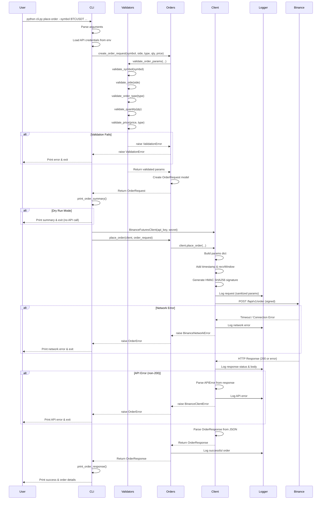

# Architecture & Data Flow

## Overview

This trading bot follows a **layered architecture** with clear separation of concerns:

1. **CLI Layer** (`cli.py`): User interface and command routing
2. **Business Logic Layer** (`bot/orders.py`): Order creation and validation orchestration
3. **Validation Layer** (`bot/validators.py`): Input validation and normalization
4. **Client Layer** (`bot/client.py`): HTTP communication and API signing
5. **Models Layer** (`bot/models.py`): Data structures for requests/responses
6. **Logging Layer** (`bot/logging_config.py`): Centralized logging configuration

## High-Level Architecture

```
┌──────────────┐
│     User     │
└──────┬───────┘
       │ CLI Commands
       ▼
┌─────────────────────────────────────────┐
│          CLI Layer (cli.py)             │
│  - Argument parsing                     │
│  - Command routing                      │
│  - Credential loading from env          │
└──────┬──────────────────────────────────┘
       │
       ▼
┌─────────────────────────────────────────┐
│    Business Layer (bot/orders.py)       │
│  - Order request creation               │
│  - Validation orchestration             │
│  - Response formatting                  │
└──────┬──────────────────────────────────┘
       │
       ├──────────────────┬────────────────┐
       ▼                  ▼                ▼
┌──────────────┐  ┌──────────────┐  ┌──────────────┐
│ Validators   │  │   Models     │  │   Logger     │
│              │  │              │  │              │
│ - Symbol     │  │ OrderRequest │  │ Rotating     │
│ - Side       │  │ OrderResponse│  │ File Handler │
│ - Type       │  │ APIError     │  │              │
│ - Quantity   │  │              │  │ Sanitization │
│ - Price      │  │              │  │              │
└──────────────┘  └──────────────┘  └──────────────┘
       │
       ▼
┌─────────────────────────────────────────┐
│  Client Layer (bot/client.py)           │
│  - HMAC SHA256 signing                  │
│  - HTTP requests (httpx)                │
│  - Error handling & retries             │
│  - Response parsing                     │
└──────┬──────────────────────────────────┘
       │ HTTPS POST
       ▼
┌─────────────────────────────────────────┐
│   Binance Futures Testnet API           │
│   https://testnet.binancefuture.com     │
└─────────────────────────────────────────┘
```

## Data Flow Diagram (Mermaid)



## Data Flow Diagram (ASCII)

```
USER INPUT
    |
    v
┌────────────────────────┐
│   CLI Argument Parser  │
│  (symbol, side, type,  │
│   quantity, price)     │
└───────────┬────────────┘
            |
            v
┌────────────────────────┐
│  Load Env Variables    │
│  (API_KEY, API_SECRET) │
└───────────┬────────────┘
            |
            v
┌────────────────────────┐
│   Validators Layer     │
│  - Check symbol format │
│  - Normalize side/type │
│  - Validate quantity   │
│  - Validate price      │
└───────────┬────────────┘
            |
        [VALID?] ──NO──> ValidationError -> Print & Exit
            |
           YES
            |
            v
┌────────────────────────┐
│  Create OrderRequest   │
│  (typed dataclass)     │
└───────────┬────────────┘
            |
            v
┌────────────────────────┐
│  Print Order Summary   │
└───────────┬────────────┘
            |
       [DRY-RUN?] ──YES──> Exit (no API call)
            |
            NO
            |
            v
┌────────────────────────┐
│  BinanceFuturesClient  │
│  - Add timestamp       │
│  - Generate signature  │
│  - Set API headers     │
└───────────┬────────────┘
            |
            v
┌────────────────────────┐
│   Log Request          │
│  (sanitize signature)  │
└───────────┬────────────┘
            |
            v
┌────────────────────────┐
│  HTTP POST Request     │
│  /fapi/v1/order        │
└───────────┬────────────┘
            |
    [NETWORK OK?] ──NO──> BinanceNetworkError -> Print & Exit
            |
           YES
            |
            v
┌────────────────────────┐
│   Parse JSON Response  │
└───────────┬────────────┘
            |
     [STATUS 200?] ──NO──> BinanceClientError -> Print & Exit
            |
           YES
            |
            v
┌────────────────────────┐
│  Create OrderResponse  │
│  (orderId, status,     │
│   executedQty, etc.)   │
└───────────┬────────────┘
            |
            v
┌────────────────────────┐
│   Log Success          │
└───────────┬────────────┘
            |
            v
┌────────────────────────┐
│  Print Order Response  │
└───────────┬────────────┘
            |
            v
        SUCCESS!
```

## Component Responsibilities

### CLI Layer (`cli.py`)

**Responsibilities:**
- Parse command-line arguments using `argparse`
- Load API credentials from environment variables
- Route commands to appropriate handlers
- Display formatted output to user
- Handle top-level exceptions

**Key Functions:**
- `get_api_credentials()`: Load API keys from env
- `cmd_test_connection()`: Test connectivity
- `cmd_place_order()`: Place order flow
- `main()`: Entry point

### Business Logic Layer (`bot/orders.py`)

**Responsibilities:**
- Orchestrate order creation and validation
- Format output for display
- Bridge between CLI and client layers

**Key Functions:**
- `create_order_request()`: Validate and create order request
- `place_order()`: Submit order via client
- `print_order_summary()`: Format request for display
- `print_order_response()`: Format response for display

### Validation Layer (`bot/validators.py`)

**Responsibilities:**
- Validate and normalize all user inputs
- Enforce business rules (e.g., price required for LIMIT)
- Raise descriptive `ValidationError` for invalid inputs

**Key Functions:**
- `validate_symbol()`: Check symbol format
- `validate_side()`: Normalize BUY/SELL
- `validate_order_type()`: Normalize MARKET/LIMIT
- `validate_quantity()`: Check quantity > 0
- `validate_price()`: Check price requirements
- `validate_order_params()`: Validate all params together

### Client Layer (`bot/client.py`)

**Responsibilities:**
- Communicate with Binance Futures API
- Implement HMAC SHA256 request signing
- Handle HTTP errors and timeouts
- Parse API responses

**Key Methods:**
- `__init__()`: Initialize HTTP client with API keys
- `_generate_signature()`: HMAC SHA256 signing
- `_sign_request()`: Add timestamp and signature to params
- `test_connectivity()`: GET /fapi/v1/time
- `place_order()`: POST /fapi/v1/order

**Authentication Flow:**
1. Add `timestamp` and `recvWindow` to params
2. Create query string from params
3. Generate HMAC SHA256 signature using secret key
4. Add signature to params
5. Send request with `X-MBX-APIKEY` header

### Models Layer (`bot/models.py`)

**Responsibilities:**
- Define typed data structures
- Convert between API format and internal format
- Provide clean interfaces for data access

**Key Classes:**
- `OrderRequest`: Typed order request
- `OrderResponse`: Parsed API response
- `APIError`: Binance error response

### Logging Layer (`bot/logging_config.py`)

**Responsibilities:**
- Configure centralized logger
- Implement rotating file handler (1MB, 3 backups)
- Sanitize sensitive data (signatures, secrets)

**Key Functions:**
- `setup_logger()`: Create logger with file handler
- `sanitize_params()`: Redact sensitive fields

**Log Output Location:** `logs/trading_bot.log`

**Log Format:**
```
YYYY-MM-DD HH:MM:SS - trading_bot - LEVEL - MESSAGE
```

## Configuration Flow

```
.env file (optional)
     |
     v
Environment Variables ─────┐
     |                     |
     v                     v
BINANCE_API_KEY      BINANCE_API_SECRET
     |                     |
     └──────────┬──────────┘
                v
      BinanceFuturesClient
                |
                v
        Signed API Requests
```

**Environment Variables:**
- `BINANCE_API_KEY` (required)
- `BINANCE_API_SECRET` (required)
- `BINANCE_BASE_URL` (optional, default: `https://testnet.binancefuture.com`)

## Error Handling Strategy

```
┌─────────────────────────────────────┐
│         Try: Execute Action         │
└────────────┬────────────────────────┘
             |
    ┌────────┴────────┬───────────┬──────────────┐
    v                 v           v              v
ValidationError  APIError    NetworkError   Unexpected
    |                |           |              |
    v                v           v              v
User-friendly   Parse API   Connection/   Log full
error msg       error JSON  Timeout msg   traceback
    |                |           |              |
    └────────────────┴───────────┴──────────────┘
                     |
                     v
             ┌───────────────┐
             │ Log to file   │
             └───────┬───────┘
                     |
                     v
             ┌───────────────┐
             │ Exit non-zero │
             └───────────────┘
```

## Security Considerations

1. **API Key Storage**: Never commit to git; use environment variables or .env
2. **Signature Redaction**: Logs sanitize signatures before writing
3. **HTTPS Only**: All communication encrypted via HTTPS
4. **Testnet Isolation**: Separate credentials from production

## Performance Considerations

1. **HTTP Connection**: Reused via context manager
2. **Timeout**: 10-second default prevents hanging
3. **Log Rotation**: Prevents disk space issues
4. **Minimal Dependencies**: Fast startup and low memory footprint

## Future Enhancements (Out of Scope)

- WebSocket support for real-time updates
- Batch order placement
- Advanced order types (Stop-Loss, Take-Profit)
- Position management
- Portfolio tracking
- Backtesting capabilities
